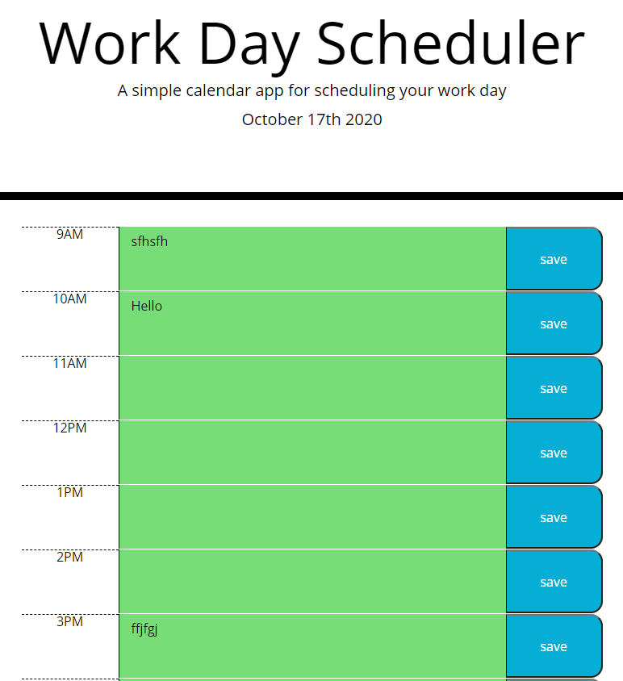

# parkers-dayplanner
Day planner for an hour by hour planning of your day

https://morgansplaygames.github.io/parkers-dayplanner/

GIVEN I am using a daily planner to create a schedule
WHEN I open the planner
THEN the current day is displayed at the top of the calendar
WHEN I scroll down
THEN I am presented with time blocks for standard business hours
WHEN I view the time blocks for that day
THEN each time block is color-coded to indicate whether it is in the past, present, or future
WHEN I click into a time block
THEN I can enter an event
WHEN I click the save button for that time block
THEN the text for that event is saved in local storage
WHEN I refresh the page
THEN the saved events persist

Created formatted rows consisting of a time, text box, and a save button.
Made a timer and moment.js to get current time.
made changed rows color to match current time
Added a save function for each button